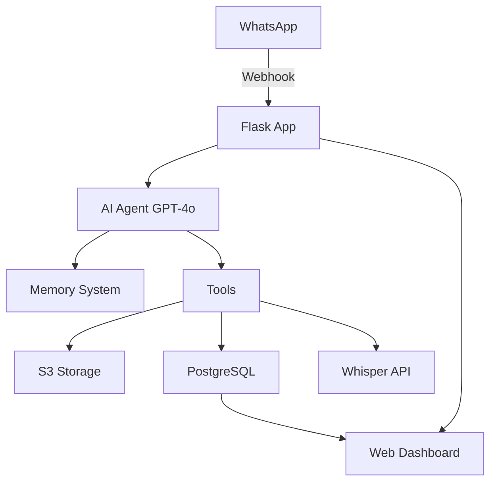
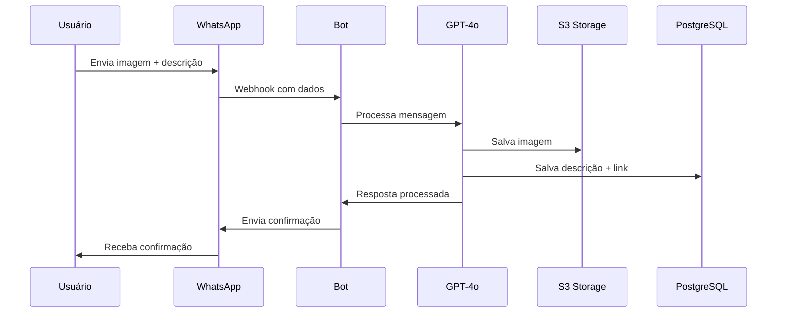

# 🤖 WhatsApp AI Image Assistant Bot

<div align="center">


*Um assistente inteligente via WhatsApp para gerenciamento de imagens com IA*

[Funcionalidades](#-funcionalidades-principais) • [Instalação](#️-instalação-e-configuração) • [Uso](#-como-usar) • [API](#-endpoints-da-api) • [Contribuir](#-contribuição)

</div>

---

## 📋 Descrição do Projeto

Este projeto é um **bot inteligente para WhatsApp** que utiliza inteligência artificial para gerenciar imagens e suas descrições. O bot é capaz de:

- 🖼️ **Receber e processar imagens** enviadas via WhatsApp
- 💾 **Armazenar imagens no S3** com acesso público
- 🗃️ **Gerenciar descrições** em banco PostgreSQL
- 🎙️ **Converter áudio em texto** usando Whisper
- 🧠 **Manter memória** das conversas com cada usuário
- 📊 **Gerar relatórios** web das imagens catalogadas

---

## ✨ Funcionalidades Principais

### 🤖 Inteligência Artificial
- **GPT-4o** para processamento de linguagem natural
- **Whisper** para transcrição de áudios
- **Memória persistente** por usuário (últimas 5 interações)
- **Aprendizado contínuo** das preferências do usuário

### 📱 Integração WhatsApp
- Recepção de **mensagens, imagens e áudios**
- Envio de **imagens e respostas** automáticas
- Suporte a **múltiplos usuários** simultâneos

### 🗄️ Gerenciamento de Dados
- **PostgreSQL** para armazenamento estruturado
- **AWS S3** para armazenamento de imagens
- **SQLite** para cache local e memória
- **Relacionamento** entre descrições e múltiplas imagens

### 📊 Interface Web
- **Dashboard** para visualização de dados
- **Relatórios** de imagens catalogadas
- **APIs RESTful** para integração

---

## 🏗️ Arquitetura



---

## 🛠️ Tecnologias Utilizadas

| Categoria | Tecnologias |
|-----------|-------------|
| **Backend** | Python 3.8+, Flask, Flask-CORS |
| **IA/ML** | OpenAI GPT-4o, Whisper, Agno Framework |
| **Banco de Dados** | PostgreSQL, SQLite |
| **Storage** | AWS S3 (Scaleway) |
| **Comunicação** | Twilio WhatsApp API |
| **Frontend** | HTML, CSS, JavaScript |
| **Deploy** | Ngrok (desenvolvimento) |

---

## 📋 Pré-requisitos

Antes de começar, você precisará de:

- 🐍 **Python 3.8+** instalado
- 🐘 **PostgreSQL** configurado
- ☁️ **Conta AWS S3** (ou Scaleway)
- 📱 **Conta Twilio** com WhatsApp ativado
- 🔑 **API Key OpenAI** 
- 🌐 **Ngrok** para tunnel local (desenvolvimento)

---

## ⚙️ Instalação e Configuração

### 1️⃣ Clone o Repositório
```bash
git clone https://github.com/seu-usuario/whatsapp-ai-bot.git
cd whatsapp-ai-bot
```

### 2️⃣ Instale as Dependências
```bash
pip install -r requirements.txt
```

### 3️⃣ Configure o Banco de Dados
```sql
-- Crie as tabelas no PostgreSQL
CREATE TABLE table_descricao (
    id SERIAL PRIMARY KEY,
    descricao TEXT NOT NULL,
    from_number VARCHAR(20),
    created_at TIMESTAMP DEFAULT CURRENT_TIMESTAMP
);

CREATE TABLE table_image_link (
    id SERIAL PRIMARY KEY,
    image_link TEXT NOT NULL,
    id_descricao INTEGER REFERENCES table_descricao(id),
    created_at TIMESTAMP DEFAULT CURRENT_TIMESTAMP
);
```

### 4️⃣ Configure as Variáveis de Ambiente
Crie um arquivo `.env` na raiz do projeto:

```env
# OpenAI
OPENAI_API_KEY=sk-your-openai-api-key

# Twilio
TWILIO_ACCOUNT_SID=your-twilio-sid
TWILIO_AUTH_TOKEN=your-twilio-token

# PostgreSQL
POSTGRES_DB_HOST=localhost
POSTGRES_DB_PORT=5432
POSTGRES_DB_NAME=whatsapp_bot
POSTGRES_DB_USER=your-username
POSTGRES_DB_PASSWORD=your-password

# S3/Scaleway
AWS_ACCESS_KEY_ID=your-access-key
AWS_SECRET_ACCESS_KEY=your-secret-key
S3_ENDPOINT=https://s3.fr-par.scw.cloud
BUCKET_NAME=your-bucket-name
PREFIX=images/
```

### 5️⃣ Execute a Aplicação
```bash
python app.py
```

### 6️⃣ Configure o Webhook do Twilio
1. Execute o Ngrok: `ngrok http 5000`
2. Configure no Twilio: `https://your-ngrok-url.ngrok.io/whatsapp`

---

## 🔧 Variáveis de Ambiente

| Variável | Descrição | Exemplo |
|----------|-----------|---------|
| `OPENAI_API_KEY` | Chave da API OpenAI | `sk-...` |
| `TWILIO_ACCOUNT_SID` | SID da conta Twilio | `AC...` |
| `TWILIO_AUTH_TOKEN` | Token de autenticação Twilio | `...` |
| `POSTGRES_DB_HOST` | Host do PostgreSQL | `localhost` |
| `POSTGRES_DB_PORT` | Porta do PostgreSQL | `5432` |
| `POSTGRES_DB_NAME` | Nome do banco de dados | `whatsapp_bot` |
| `POSTGRES_DB_USER` | Usuário do banco | `postgres` |
| `POSTGRES_DB_PASSWORD` | Senha do banco | `password` |
| `AWS_ACCESS_KEY_ID` | Chave de acesso S3 | `AKIA...` |
| `AWS_SECRET_ACCESS_KEY` | Chave secreta S3 | `...` |
| `S3_ENDPOINT` | Endpoint do S3 | `https://s3.fr-par.scw.cloud` |
| `BUCKET_NAME` | Nome do bucket S3 | `my-images-bucket` |
| `PREFIX` | Prefixo para arquivos | `images/` |

---

## 📊 Estrutura do Banco de Dados

### 📝 table_descricao
| Campo | Tipo | Descrição |
|-------|------|-----------|
| `id` | SERIAL PRIMARY KEY | ID único da descrição |
| `descricao` | TEXT | Texto da descrição da imagem |
| `from_number` | VARCHAR(20) | Número do telefone do usuário |
| `created_at` | TIMESTAMP | Data de criação |

### 🖼️ table_image_link
| Campo | Tipo | Descrição |
|-------|------|-----------|
| `id` | SERIAL PRIMARY KEY | ID único do link |
| `image_link` | TEXT | URL da imagem no S3 |
| `id_descricao` | INTEGER | FK para table_descricao |
| `created_at` | TIMESTAMP | Data de criação |

---

## 🚀 Como Usar

### 📱 Via WhatsApp

1. **Envie uma imagem** com descrição:
   ```
   "Esta é uma foto do meu cachorro"
   [imagem anexada]
   ```

2. **Envie apenas uma imagem**:
   - O bot pedirá uma descrição

3. **Busque imagens**:
   ```
   "Mostre fotos de cachorro"
   ```

4. **Envie áudio**:
   - O bot converterá em texto automaticamente

### 🎯 Comandos Principais

| Comando | Descrição |
|---------|-----------|
| Enviar imagem + texto | Salva imagem com descrição |
| Enviar apenas imagem | Bot solicita descrição |
| "Mostre [descrição]" | Busca e exibe imagens |
| Enviar áudio | Converte áudio em texto |
| Conversa natural | IA responde contextualmente |

---

## 📱 Endpoints da API

### 🔄 Webhook Principal
- **POST** `/whatsapp` - Recebe mensagens do WhatsApp

### 🧠 Gerenciamento de Memória
- **POST** `/clear-memory` - Limpa memória global
- **POST** `/clear-user-memory/<session>` - Limpa memória de usuário
- **GET** `/memory-status/<user_number>` - Status da memória

### 📊 Relatórios e Dados
- **GET** `/report` - Dashboard web
- **GET** `/get-report-data` - Dados em JSON
- **GET** `/agent-messages` - Histórico de mensagens
- **GET** `/memory-content` - Conteúdo da memória

---

## 🎯 Fluxo de Funcionamento



---

## 📸 Screenshots

### 💬 Conversa no WhatsApp
```
👤 Usuário: [Envia foto de um gato]
🤖 Bot: Imagem salva com sucesso! Por favor, me diga uma descrição para esta imagem.

👤 Usuário: "Meu gato dormindo no sofá"
🤖 Bot: ✅ Perfeito! Salvei a descrição "Meu gato dormindo no sofá" 
         e associei à imagem. Agora posso te ajudar a encontrá-la sempre que precisar!

👤 Usuário: "Mostre fotos de gato"
🤖 Bot: Encontrei 1 imagem relacionada a "gato":
         [Envia a imagem salva]
```

### 📊 Dashboard Web
*Visualização organizada de todas as descrições e suas imagens associadas*

---

## 🐛 Troubleshooting

### ❌ Problemas Comuns

**Erro de conexão com PostgreSQL**
```bash
# Verifique se o PostgreSQL está rodando
sudo service postgresql status

# Teste a conexão manualmente
psql -h localhost -U your-username -d whatsapp_bot
```

**Webhook não recebe mensagens**
- ✅ Verifique se o Ngrok está ativo
- ✅ URL do webhook configurada no Twilio
- ✅ Porta 5000 não está bloqueada

**Erro ao salvar imagens no S3**
- ✅ Credenciais AWS configuradas
- ✅ Bucket existe e tem permissões públicas
- ✅ Endpoint S3 correto

**IA não responde adequadamente**
- ✅ API Key OpenAI válida
- ✅ Saldo suficiente na conta OpenAI
- ✅ Modelo GPT-4o disponível

---

## 🔄 Roadmap

- [ ] 🌐 Interface web mais robusta
- [ ] 📊 Analytics avançados
- [ ] 🔍 Busca por similaridade de imagens
- [ ] 📝 OCR para extração de texto de imagens
- [ ] 🎨 Geração de imagens com DALL-E
- [ ] 📱 App mobile nativo
- [ ] 🔒 Sistema de autenticação
- [ ] 📈 Dashboard com métricas

---

## 🤝 Contribuição

Contribuições são sempre bem-vindas! Para contribuir:

1. 🍴 **Fork** o projeto
2. 🌟 Crie uma **branch** para sua feature (`git checkout -b feature/AmazingFeature`)
3. 📝 **Commit** suas mudanças (`git commit -m 'Add some AmazingFeature'`)
4. 📤 **Push** para a branch (`git push origin feature/AmazingFeature`)
5. 🔄 Abra um **Pull Request**

### 📋 Diretrizes
- Código bem documentado
- Testes para novas funcionalidades
- Seguir padrões PEP 8
- atualizar documentação quando necessário

---

## 📄 Licença

Este projeto está sob a licença MIT. Veja o arquivo [LICENSE](LICENSE) para mais detalhes.

---

## 👤 Autor

**Seu Nome**
- 🐙 GitHub: [@maubaum](https://github.com/maubaum)
- 📧 Email: mauriciobaum@gmail.com
- 💼 LinkedIn: [https://linkedin.com/in/mauriciobaum](https://linkedin.com/in/mauriciobaum)

---

## 🙏 Agradecimentos

- [OpenAI](https://openai.com) pela API GPT-4o e Whisper
- [Twilio](https://twilio.com) pela integração WhatsApp
- [Agno Framework](https://github.com/phidatahq/phidata) pelo framework de IA
- Comunidade open source 💚

---

<div align="center">

**⭐ Se este projeto te ajudou, deixe uma estrela! ⭐**

*Feito com ❤️ e muito ☕*

</div>